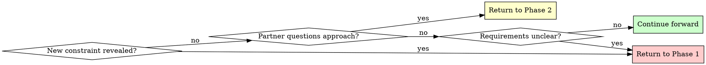

# Brainstorming Ideas Into Designs

## Overview

Transform rough ideas into fully-formed designs through structured questioning and alternative exploration.

**Core principle:** Ask questions to understand, explore alternatives, present design incrementally for validation.

**Announce at start:** "I'm using the brainstorming skill to refine your idea into a design."

## Quick Reference

| Phase | Key Activities | Tool Usage | Output |
|-------|---------------|------------|--------|
| **1. Understanding** | Ask questions (one at a time) | AskUserQuestion for choices, agents for research | Purpose, constraints, criteria |
| **2. Exploration** | Propose 2-3 approaches | AskUserQuestion for approach selection, agents for patterns | Architecture options with trade-offs |
| **3. Create bd Structure** | Create epic + skeleton phase tasks | bd CLI commands | Epic and placeholder tasks in bd |
| **4. Design Presentation** | Present sections, update bd tasks | Open-ended questions, bd update | bd tasks with validated designs |
| **5. Refine Subtask Granularity** | Break large tasks into subtasks if needed | bd CLI commands | All tasks properly sized (4-8 hours) |
| **6. Validate and Refine** | Review and improve all issues | sre-task-refinement skill | Plan approved or revision needed |
| **7. Enhance bd Tasks** | Expand tasks with detailed implementation steps | writing-plans skill | Enhanced bd issues |

## The Process

**REQUIRED: Create TodoWrite tracker at start**

Use TodoWrite to create todos for each phase:

- Phase 1: Understanding (MUST invoke AskUserQuestion 3+ times, gather purpose/constraints/criteria)
- Phase 2: Exploration (2-3 approaches proposed and evaluated)
- Phase 3: Create bd Structure (epic + skeleton phase tasks created in bd)
- Phase 4: Design Presentation (present sections, update bd tasks incrementally)
- Phase 5: Refine Subtask Granularity (break large tasks into 4-8 hour subtasks)
- Phase 6: Validate and Refine (plan reviewed and approved by sre-task-refinement)
- Phase 7: Enhance bd Tasks (tasks expanded with detailed implementation steps)

Mark each phase as in_progress when working on it, completed when finished.

## Research Agents

**DO NOT perform deep research yourself. Delegate to specialized agents.**

### When to Use codebase-investigator

**Use @agent-codebase-investigator when you need to:**
- Understand how existing features are implemented
- Find where specific functionality lives in the codebase
- Identify existing patterns to follow
- Verify assumptions about codebase structure
- Check if a feature already exists

**Example delegation:**
```
Question: "How is authentication currently implemented?"
Action: Dispatch codebase-investigator with: "Find authentication implementation, including file locations, patterns used, and dependencies"
```

### When to Use internet-researcher

**Use @agent-internet-researcher when you need to:**
- Find current API documentation for external services
- Research library capabilities and best practices
- Compare technology options
- Understand current community recommendations
- Find code examples and patterns from documentation

**Example delegation:**
```
Question: "What's the recommended way to handle file uploads with this framework?"
Action: Dispatch internet-researcher with: "Find current best practices for file uploads in [framework], including official docs and common patterns"
```

### Research Protocol

**If codebase pattern exists:**
1. Use codebase-investigator to find it
2. Unless pattern is clearly unwise, assume it's the correct approach
3. Design should follow existing patterns for consistency

**If no codebase pattern exists:**
1. Use internet-researcher to find external patterns
2. Present 2-3 approaches from research in Phase 2
3. Let user choose which pattern to adopt

**If agent can't find answer:**
- Redirect question to user via AskUserQuestion
- Explain what was searched and not found
- Present as a design decision for user to make

**Be persistent with agents:**
- If first query doesn't yield results, refine the question
- Try alternative search terms or approaches
- Don't give up after one attempt

### Phase 1: Understanding

**CRITICAL: You CANNOT skip this phase. Questions reveal hidden constraints even with detailed requests.**

**Before asking questions:**

1. **Investigate current state** - DON'T do this yourself:
   - Dispatch codebase-investigator to verify project structure
   - Ask investigator to find existing architecture and patterns
   - Ask investigator to identify constraints from current codebase
   - Review investigator's findings before proceeding

2. **Then gather requirements - MANDATORY:**
   - Mark Phase 1 as in_progress in TodoWrite
   - **YOU MUST invoke AskUserQuestion tool at least 3 times**
   - DO NOT output text claiming you asked questions
   - DO NOT proceed without actual tool invocations
   - Ask ONE question at a time to refine the idea
   - **Use AskUserQuestion tool** when you have multiple choice options
   - **Use agents** when you need to verify technical information
   - Gather: Purpose, constraints, success criteria

**If you catch yourself thinking:**
- "The user's request is detailed enough"
- "I have context from codebase-investigator"
- "I can infer what they want"
- "This is straightforward, don't need questions"

**STOP. You are rationalizing. USE THE AskUserQuestion TOOL.**

**Phase 1 Completion Checklist:**
- [ ] AskUserQuestion tool invoked at least 3 times
- [ ] Purpose clearly understood
- [ ] Constraints identified
- [ ] Success criteria gathered
- [ ] Mark Phase 1 as completed in TodoWrite

**Verification:** Look at your message history. Do you see `<invoke name="AskUserQuestion">`?
- If YES → Continue to Phase 2
- If NO → You skipped Phase 1. Go back and ask questions now.

**Example using AskUserQuestion:**
```
Question: "Where should the authentication data be stored?"
Options:
  - "Session storage" (clears on tab close, more secure)
  - "Local storage" (persists across sessions, more convenient)
  - "Cookies" (works with SSR, compatible with older approach)
```

**When to delegate vs ask user:**
- "Where is auth implemented?" → codebase-investigator
- "What auth library should we use?" → internet-researcher (if not in codebase)
- "Do you want JWT or sessions?" → AskUserQuestion (design decision)

### Phase 2: Exploration

**Before proposing approaches:**

1. **Research existing patterns** - DON'T do this yourself:
   - Dispatch codebase-investigator: "Find similar features and patterns used"
   - If similar feature exists, base one approach on that pattern
   - If no codebase pattern, dispatch internet-researcher: "Find recommended approaches for [problem]"
   - Review research findings before proposing

2. **Then propose approaches:**
   - Mark Phase 2 as in_progress in TodoWrite
   - Propose 2-3 different approaches based on research
   - At least one approach should follow codebase patterns (if they exist)
   - For each: Core architecture, trade-offs, complexity assessment
   - **Use AskUserQuestion tool** to present approaches as structured choices
   - Mark Phase 2 as completed when approach is selected

**Example using AskUserQuestion:**
```
Question: "Which architectural approach should we use?"
Options:
  - "Event-driven with message queue" (matches existing notification system, scalable, complex setup)
  - "Direct API calls with retry logic" (simple, synchronous, easier to debug)
  - "Hybrid with background jobs" (balanced, moderate complexity, best of both)
```

**Research integration:**
- If codebase has pattern → Present it as primary option (unless unwise)
- If no codebase pattern → Present internet research findings
- If research yields nothing → Ask user for direction

### Phase 3: Create bd Structure

**Goal:** Create epic and skeleton phase tasks in bd to reduce context usage. Design will be added incrementally in Phase 4.

- Mark Phase 3 as in_progress in TodoWrite

#### 1. Initialize bd (if not already done)
```bash
bd init --prefix bd
```

#### 2. Create Parent Epic with Minimal, Stable Content

**CRITICAL:** Keep epic lightweight. DO NOT include detailed design here.

```bash
bd create "Feature: [Feature Name]" \
  --type epic \
  --priority [0-4] \
  --design "## Goal
[1-2 sentences: what business problem does this solve?]

## Chosen Approach
[High-level summary of approach selected in Phase 2]

## Success Criteria
- [ ] All phases complete
- [ ] Integration tests passing
- [ ] Documentation updated
- [ ] Pre-commit hooks pass"
```

Note the epic issue ID returned (e.g., `bd-1`).

#### 3. Create Skeleton Phase Tasks

Based on anticipated major phases (typically 3-5), create placeholder tasks:

```bash
bd create "Phase 1: [Descriptive Name]" \
  --type feature \
  --priority [0-4] \
  --design "## Goal
[One sentence: what specific deliverable this phase produces]

## Design
[Will be expanded in Phase 4]"
```

Repeat for each anticipated phase. Note each task ID (e.g., `bd-2`, `bd-3`, etc.).

#### 4. Link Tasks to Epic

```bash
# Link phases to epic using parent-child
bd dep add bd-2 bd-1 --type parent-child  # Phase 1 is child of Epic
bd dep add bd-3 bd-1 --type parent-child  # Phase 2 is child of Epic
bd dep add bd-4 bd-1 --type parent-child  # Phase 3 is child of Epic
# ... etc for all phases

# Add blocking dependencies for sequential phases
bd dep add bd-3 bd-2  # Phase 2 depends on Phase 1
bd dep add bd-4 bd-3  # Phase 3 depends on Phase 2
# ... etc
```

#### 5. Verify Structure

```bash
bd dep tree bd-1  # View tree for epic
bd ready          # Should show only bd-2 (first phase)
```

- Mark Phase 3 as completed when bd structure is created

**Next:** Phase 4 will expand these skeleton tasks with actual design content.

### Phase 4: Design Presentation

**Goal:** Present design incrementally and store validated sections in bd tasks. This keeps context usage low.

- Mark Phase 4 as in_progress in TodoWrite

#### Design Presentation Protocol

For each phase task created in Phase 3:

1. **Present design section (200-300 words)**
   - Cover relevant aspects: Architecture, components, data flow, error handling, testing
   - **Use agents if you need to verify technical details**
   - Keep it in one message so user can see complete section

2. **Ask for validation (open-ended)**
   - "Does this look right so far?"
   - Allow freeform feedback
   - If changes needed, revise and re-present

3. **Update bd task with validated design**

   Once section is validated, update the corresponding bd task:

   ```bash
   bd update bd-2 --design "## Goal
   [What this phase delivers]

   ## Design

   ### Architecture
   [Validated architecture content]

   ### Components
   [Validated components content]

   ### Implementation Approach

   #### 1. Study Existing Code
   [Point to 2-3 similar implementations in codebase]

   #### 2. Write Tests First (TDD)
   [Specific test cases to write]

   #### 3. Implementation Checklist
   - [ ] File path:line - function_name() - [exactly what it must do]
   - [ ] Test file:line - test_name() - [what scenario it tests]

   #### 4. Key Considerations
   - **Error Handling**: [Specific error cases]
   - **Edge Cases**: [Empty input, large input, etc.]
   - **Dependencies**: [What this depends on]

   ## Success Criteria
   - [ ] All functions/modules fully implemented
   - [ ] Tests written and passing
   - [ ] Pre-commit hooks pass
   - [ ] [Specific behavioral criteria]

   ## Anti-patterns to Avoid
   - ❌ No stub implementations
   - ❌ No TODOs without bd issue numbers
   - ❌ [Phase-specific anti-patterns]"
   ```

4. **Move to next phase task**
   - Repeat for each task created in Phase 3
   - Each task gets its own design section

- Mark Phase 4 as completed when all phase tasks have validated designs

**Benefits:**
- Context freed after each section is stored in bd
- bd tasks contain complete design details
- Can resume after interruption by reading from bd

### Phase 5: Refine Subtask Granularity

**Goal:** Check if any phase tasks are too large (>16 hours) and break them into subtasks.

- Mark Phase 5 as in_progress in TodoWrite

#### Review Task Sizes

For each phase task created in Phase 3 and expanded in Phase 4:

1. **Estimate effort based on design**
   - Review the implementation checklist
   - Count files, functions, tests to implement
   - Estimate: 4-8 hours ideal, up to 16 hours acceptable

2. **If task is >16 hours, break it down**

   Create subtasks:

   ```bash
   # Example: Phase 2 is estimated at 50 hours - break into subtasks
   bd create "Subtask 1: Vehicle Identifiers" --type task --priority 1 \
     --design "## Goal
   [What this specific subtask delivers - 1 sentence]

   ## Design
   [Copy relevant portion from parent task's design]

   ## Implementation Checklist
   - [ ] file:line - function() - [what it does]
   - [ ] test:line - test_name() - [what it tests]

   ## Success Criteria
   - [ ] Functions implemented
   - [ ] Tests passing
   - [ ] Pre-commit hooks pass

   ## Effort Estimate
   6-8 hours"
   # Returns bd-6

   bd create "Subtask 2: Medical Device IDs" --type task --priority 1 \
     --design "[Similar structure, 4-6 hours]"
   # Returns bd-7

   # Link subtasks to parent phase
   bd dep add bd-6 bd-3 --type parent-child  # Subtask is child of Phase
   bd dep add bd-7 bd-3 --type parent-child

   # Add sequential dependencies if needed
   bd dep add bd-7 bd-6  # bd-7 depends on bd-6 (do bd-6 first)
   ```

3. **Keep small tasks as-is**
   - If task is ≤16 hours, no changes needed
   - It will be implemented as a single unit

#### Verify Final Structure

```bash
bd dep tree bd-1  # View complete tree
bd ready          # Should show first workable task

# NOTE: Epics may appear in `bd ready` but are not workable.
# Focus on tasks with type 'task' or 'feature'.
```

- Mark Phase 5 as completed when all tasks are properly sized

**Result:** All tasks are 4-16 hours, ready for implementation.


### Phase 6: Validate and Refine

Now have the plan reviewed by an SRE perspective to catch issues before implementation.

- Mark Phase 6 as in_progress in TodoWrite
- Announce: "I'm using the sre-task-refinement skill to review the plan."
- **REQUIRED SUB-SKILL:** Use hyper:sre-task-refinement
- sre-task-refinement will:
  - Review all issues for completeness
  - Check task granularity (no task >16 hours)
  - Verify junior-engineer implementability
  - Identify missing edge cases
  - Update issues with improvements via `bd update`
  - Provide approval or request revisions
- If major revisions needed, re-run hyper:sre-task-refinement
- Mark Phase 6 as completed when plan is approved


### Phase 7: Enhance bd Tasks

Now expand the approved bd tasks with detailed step-by-step implementation instructions.

- Mark Phase 7 as in_progress in TodoWrite
- Announce: "I'm using the writing-plans skill to enhance the bd tasks with detailed steps."
- **REQUIRED SUB-SKILL:** Use hyper:writing-plans
- writing-plans will:
  - Read the epic and all tasks from bd
  - Verify codebase state for each task
  - Expand implementation checklists into detailed steps with complete code
  - Validate each task expansion with user before updating bd
  - Update each bd issue with enhanced design using `bd update`
  - Offer execution choice (executing-plans skill)
- Mark Phase 7 as completed when all bd tasks are enhanced

**After Phase 7:**
- bd issues contain complete execution-ready instructions
- User can execute using hyper:executing-plans
- All implementation details live in bd (no separate markdown files)

**Complete workflow:**
```
brainstorming (Phases 1-7)
    ↓
executing-plans (executes bd tasks, updates status)
    ↓
review-implementation (verifies against spec)
    ↓
finishing-a-development-branch (closes epic, creates PR)
```

## Question Patterns

### When to Use AskUserQuestion Tool

**Use AskUserQuestion for:**
- Phase 1: Clarifying questions with 2-4 clear options
- Phase 2: Architectural approach selection (2-3 alternatives)
- Any decision with distinct, mutually exclusive choices
- When options have clear trade-offs to explain
- When agent research yields no answer (present as open decision)

**Benefits:**
- Structured presentation of options with descriptions
- Clear trade-off visibility for partner
- Forces explicit choice (prevents vague "maybe both" responses)

### When to Use Open-Ended Questions

**Use open-ended questions for:**
- Phase 4: Design validation ("Does this look right so far?")
- When you need detailed feedback or explanation
- When partner should describe their own requirements
- When structured options would limit creative input

**Example decision flow:**
- "What authentication method?" → Use AskUserQuestion (2-4 options)
- "Does this design handle your use case?" → Open-ended (validation)

### When to Use Research Agents

**Use codebase-investigator for:**
- "How is X implemented?" → Agent finds and reports
- "Where does Y live?" → Agent locates files
- "What pattern exists for Z?" → Agent identifies pattern

**Use internet-researcher for:**
- "What's the current API for X?" → Agent finds docs
- "How do people handle Y?" → Agent finds patterns
- "What libraries exist for Z?" → Agent researches options

**Don't do deep research yourself** - you'll consume context and may hallucinate. Agents are specialized for this.

## When to Revisit Earlier Phases



**You can and should go backward when:**
- Partner reveals new constraint during Phase 2, 3, or 4 → Return to Phase 1
- Validation shows fundamental gap in requirements → Return to Phase 1
- Partner questions approach during Phase 4 (Design) → Return to Phase 2
- Something doesn't make sense → Go back and clarify
- Agent research reveals constraint you didn't know → Reassess phase

**Don't force forward linearly** when going backward would give better results.

## Common Rationalizations - STOP

These are violations of the skill requirements:

| Excuse | Reality |
|--------|---------|
| "Idea is simple, can skip exploring alternatives" | Always propose 2-3 approaches. Comparison reveals issues. |
| "Partner knows what they want, can skip questions" | Questions reveal hidden constraints. Always ask. |
| "Request is detailed, don't need AskUserQuestion" | MUST invoke tool 3+ times. Output text is not asking. |
| "I'll present whole design at once for efficiency" | Incremental validation catches problems early. |
| "Checklist is just a suggestion" | Create TodoWrite todos. Track progress properly. |
| "Design doc structure doesn't matter" | sre-task-refinement expects structured issues. Follow the structure. |
| "I can research this quickly myself" | Use agents. You'll hallucinate or consume excessive context. |
| "Agent didn't find it on first try, must not exist" | Be persistent. Refine query and try again. |
| "This is small, don't need worktree" | If implementing, use worktree. Isolation prevents mistakes. |
| "Partner said yes, can skip refinement phase" | sre-task-refinement catches critical gaps. Always run Phase 6. |
| "I know this codebase, don't need investigator" | You don't know current state. Always verify. |
| "Obvious solution, skip research" | Codebase may have established pattern. Check first. |

**All of these mean: STOP. Follow the requirements exactly.**

**For more common rationalizations, see:** `skills/common-patterns/common-rationalizations.md`

## Key Principles

| Principle | Application |
|-----------|-------------|
| **One question at a time** | YOU MUST ask single questions in Phase 1, use AskUserQuestion for choices |
| **Delegate research** | YOU MUST use agents for codebase and internet research, never do it yourself |
| **Be persistent with agents** | If agent doesn't find answer, refine query and try again before asking user |
| **Follow existing patterns** | If codebase pattern exists and is reasonable, design must follow it |
| **Structured choices** | YOU MUST use AskUserQuestion tool for 2-4 options with trade-offs |
| **YAGNI ruthlessly** | Remove unnecessary features from all designs |
| **Explore alternatives** | YOU MUST propose 2-3 approaches before settling |
| **Incremental validation** | Present design in sections, validate each - never all at once |
| **TodoWrite tracking** | YOU MUST create TodoWrite todos at start, update as you progress |
| **Phase structure required** | Design document MUST include discrete implementation phases (≤8 recommended) |
| **Flexible progression** | Go backward when needed - flexibility > rigidity |
