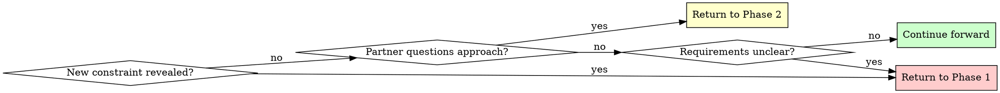

- ❌ You forget to run hyperpowers:sre-task-refinement (Phase 6)
- ❌ You forget to run hyperpowers:writing-plans (Phase 7)

**Always check TodoWrite after interruption to resume at correct phase.**

## When to Revisit Earlier Phases

**You can and should go backward when:**
- Partner reveals new constraint during Phase 2, 3, or 4 → Return to Phase 1
- Validation shows fundamental gap in requirements → Return to Phase 1
- Partner questions approach during Phase 4 (Design) → Return to Phase 2
- Something doesn't make sense → Go back and clarify
- Agent research reveals constraint you didn't know → Reassess phase

**Don't force forward linearly** when going backward would give better results.

## Common Rationalizations - STOP

These are violations of the skill requirements:

| Excuse | Reality |
|--------|---------|
| "Idea is simple, can skip exploring alternatives" | Always propose 2-3 approaches. Comparison reveals issues. |
