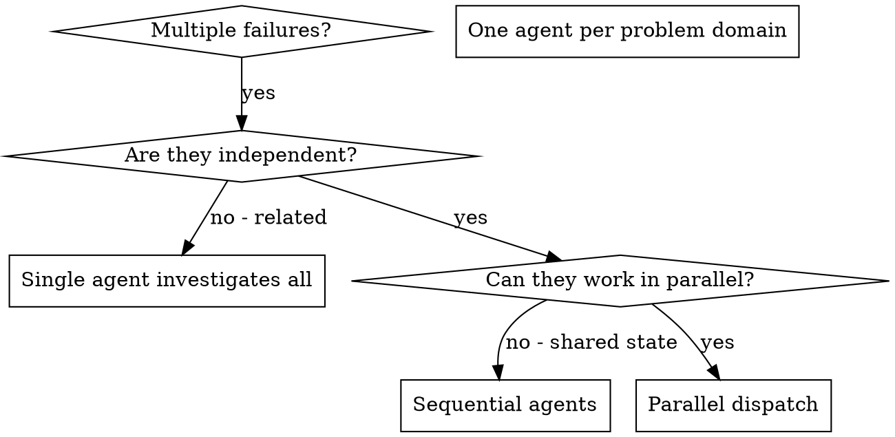

# Dispatching Parallel Agents

## Overview

When you have multiple unrelated failures (different test files, different subsystems, different bugs), investigating them sequentially wastes time. Each investigation is independent and can happen in parallel.

**Core principle:** Dispatch one agent per independent problem domain. Let them work concurrently.

**Announce at start:** "I'm using the dispatching-parallel-agents skill to investigate these independent failures concurrently."

## Quick Reference

| Step | Action | Output |
|------|--------|--------|
| **1. Identify Domains** | Group failures by independence | 3+ independent problem domains |
| **2. Create Agent Tasks** | Write focused prompts with scope/goal/constraints | One prompt per domain |
| **3. Dispatch Agents** | Launch all agents in single message | Multiple Task() calls in parallel |
| **4. Monitor Progress** | Track which agents complete | Status updates |
| **5. Review Results** | Read summaries, check conflicts | Integration plan |
| **6. Verify Together** | Run full test suite | All fixes working |

## When to Use



**Use when:**
- 3+ test files failing with different root causes
- Multiple subsystems broken independently
- Each problem can be understood without context from others
- No shared state between investigations
- You've verified failures are truly independent (run one fix, doesn't affect others)
- Each domain has clear boundaries (different files, modules, or features)

**Why 3+?** With only 2 failures, overhead of coordination often exceeds sequential investigation time. With 3+, parallelization wins clearly.

**When to avoid:**
- Failures are related (fix one might fix others)
- Need to understand full system state first
- Agents would interfere with each other (editing same files)
- You haven't identified independence yet (exploratory phase)
- Failures share root cause (one bug manifesting in multiple places)
- Need to preserve investigation order (cascading failures)

## The Pattern

**REQUIRED: Create TodoWrite tracker at start**

Use TodoWrite to track parallel agent work:

```
- Identify independent domains (3+ domains identified)
- Create agent tasks (one prompt per domain drafted)
- Dispatch agents in parallel (all agents launched in single message)
- Monitor agent progress (track completions)
- Review results (summaries read, conflicts checked)
- Verify integration (full test suite green)
```

### 1. Identify Independent Domains

**How to test for independence:**
1. Ask: "If I fix failure A, does it affect failure B?"
   - If NO → Independent
   - If YES → Related, investigate together
2. Check: "Do failures touch same code/files?"
   - If NO → Likely independent
   - If YES → Check if different functions/areas
3. Verify: "Do failures share error patterns?"
   - If NO → Independent
   - If YES → Might be same root cause

**Group failures by what's broken:**
- File A tests: Tool approval flow
- File B tests: Batch completion behavior
- File C tests: Abort functionality

Each domain is independent - fixing tool approval doesn't affect abort tests.

**Example independence check:**
```
Failure 1: Authentication tests failing (auth.test.ts)
Failure 2: Database query tests failing (db.test.ts)
Failure 3: API endpoint tests failing (api.test.ts)

Check: Does fixing auth affect db queries? NO
Check: Does fixing db affect API? YES - API uses db

Result: 2 independent domains:
  Domain 1: Authentication (auth.test.ts)
  Domain 2: Database + API (db.test.ts + api.test.ts together)
```

### 2. Create Focused Agent Tasks

Each agent gets:
- **Specific scope:** One test file or subsystem
- **Clear goal:** Make these tests pass
- **Constraints:** Don't change other code
- **Expected output:** Summary of what you found and fixed

### 3. Dispatch in Parallel

**CRITICAL:** You must dispatch all agents in a SINGLE message with multiple Task() calls.

```typescript
// ✅ CORRECT - Single message with multiple parallel tasks
Task("Fix agent-tool-abort.test.ts failures", prompt1)
Task("Fix batch-completion-behavior.test.ts failures", prompt2)
Task("Fix tool-approval-race-conditions.test.ts failures", prompt3)
// All three run concurrently

// ❌ WRONG - Sequential messages
Task("Fix agent-tool-abort.test.ts failures", prompt1)
// Wait for response
Task("Fix batch-completion-behavior.test.ts failures", prompt2)
// This is sequential, not parallel!
```

**After dispatch:**
- Mark "Dispatch agents in parallel" as completed in TodoWrite
- Mark "Monitor agent progress" as in_progress
- Wait for all agents to complete before integration

### 4. Monitor Progress

As agents work:
- Note which agents have completed
- Note which are still running
- Don't start integration until ALL agents done

**If an agent gets stuck (>5 minutes):**
1. Check AgentOutput to see what it's doing
2. If truly stuck, you can cancel and retry with clearer prompt
3. Consider if domain was actually independent

### 5. Review and Integrate

**When all agents return:**

1. **Read each summary carefully**
   - What was the root cause?
   - What did the agent change?
   - Were there any uncertainties?

2. **Check for conflicts**
   - Did multiple agents edit same files?
   - Did agents make contradictory assumptions?
   - Are there integration points between domains?

3. **Integration strategy:**
   - If no conflicts: Apply all changes
   - If conflicts: Resolve manually before applying
   - If assumptions conflict: Verify with user

4. **Run full test suite**
   - Not just the fixed tests
   - Verify no regressions in other areas
   - Use hyperpowers:verification-before-completion skill

5. **Document what happened**
   - Which agents fixed what
   - Any conflicts found
   - Final verification results

## Agent Prompt Structure

Good agent prompts are:
1. **Focused** - One clear problem domain
2. **Self-contained** - All context needed to understand the problem
3. **Specific about output** - What should the agent return?

```markdown
Fix the 3 failing tests in src/agents/agent-tool-abort.test.ts:

1. "should abort tool with partial output capture" - expects 'interrupted at' in message
2. "should handle mixed completed and aborted tools" - fast tool aborted instead of completed
3. "should properly track pendingToolCount" - expects 3 results but gets 0

These are timing/race condition issues. Your task:

1. Read the test file and understand what each test verifies
2. Identify root cause - timing issues or actual bugs?
3. Fix by:
   - Replacing arbitrary timeouts with event-based waiting
   - Fixing bugs in abort implementation if found
   - Adjusting test expectations if testing changed behavior

Never just increase timeouts - find the real issue.

Return: Summary of what you found and what you fixed.
```

## Common Mistakes

**❌ Too broad:** "Fix all the tests" - agent gets lost
**✅ Specific:** "Fix agent-tool-abort.test.ts" - focused scope

**❌ No context:** "Fix the race condition" - agent doesn't know where
**✅ Context:** Paste the error messages and test names

**❌ No constraints:** Agent might refactor everything
**✅ Constraints:** "Do NOT change production code" or "Fix tests only"

**❌ Vague output:** "Fix it" - you don't know what changed
**✅ Specific:** "Return summary of root cause and changes"

## When NOT to Use

**Related failures:** Fixing one might fix others - investigate together first
**Need full context:** Understanding requires seeing entire system
**Exploratory debugging:** You don't know what's broken yet
**Shared state:** Agents would interfere (editing same files, using same resources)

## Real Example from Session

**Scenario:** 6 test failures across 3 files after major refactoring

**Failures:**
- agent-tool-abort.test.ts: 3 failures (timing issues)
- batch-completion-behavior.test.ts: 2 failures (tools not executing)
- tool-approval-race-conditions.test.ts: 1 failure (execution count = 0)

**Decision:** Independent domains - abort logic separate from batch completion separate from race conditions

**Dispatch:**
```
Agent 1 → Fix agent-tool-abort.test.ts
Agent 2 → Fix batch-completion-behavior.test.ts
Agent 3 → Fix tool-approval-race-conditions.test.ts
```

**Results:**
- Agent 1: Replaced timeouts with event-based waiting
- Agent 2: Fixed event structure bug (threadId in wrong place)
- Agent 3: Added wait for async tool execution to complete

**Integration:** All fixes independent, no conflicts, full suite green

**Time saved:** 3 problems solved in parallel vs sequentially

## Key Benefits

1. **Parallelization** - Multiple investigations happen simultaneously
2. **Focus** - Each agent has narrow scope, less context to track
3. **Independence** - Agents don't interfere with each other
4. **Speed** - 3 problems solved in time of 1

## Verification

After agents return:
1. **Review each summary** - Understand what changed
2. **Check for conflicts** - Did agents edit same code?
3. **Run full suite** - Verify all fixes work together
4. **Spot check** - Agents can make systematic errors

## Failure Modes and Recovery

### Agent Gets Stuck

**Symptoms:** No progress after 5+ minutes

**Causes:**
- Prompt too vague, agent exploring aimlessly
- Domain not actually independent, needs context from other agents
- Agent hit a blocker (missing file, unclear error)

**Recovery:**
1. Use AgentOutput tool to check what it's doing
2. If stuck on wrong path: Cancel and retry with clearer prompt
3. If needs context from other domain: Wait for other agent, then restart with context
4. If hit real blocker: Investigate blocker yourself, then retry

### Agents Return Conflicting Fixes

**Symptoms:** Agents edited same code differently, or made contradictory assumptions

**Causes:**
- Domains weren't actually independent
- Shared code between domains
- Agents made different assumptions about correct behavior

**Recovery:**
1. Don't apply either fix automatically
2. Read both fixes carefully
3. Identify the conflict point
4. Resolve manually based on which assumption is correct
5. Consider if domains should be merged

### Integration Breaks Other Tests

**Symptoms:** Fixed tests pass, but other tests now fail

**Causes:**
- Agent changed shared code
- Agent's fix was too broad
- Agent misunderstood requirements

**Recovery:**
1. Identify which agent's change caused the regression
2. Read the agent's summary - did they mention this change?
3. Evaluate if change is correct but tests need updating
4. Or if change broke something, need to refine the fix
5. Use hyperpowers:verification-before-completion skill for final check

### False Independence

**Symptoms:** Fixing one domain revealed it affected another

**Recovery:**
1. Merge the domains
2. Have one agent investigate both together
3. Learn: Better independence test needed upfront

## Common Rationalizations - STOP

| Excuse | Reality |
|--------|---------|
| "Just 2 failures, can still parallelize" | Overhead exceeds benefit. Do sequentially. |
| "Probably independent, will dispatch and see" | Verify independence FIRST. Bad parallel dispatch wastes time. |
| "Can dispatch sequentially to save syntax" | WRONG. Must dispatch in single message or it's not parallel. |
| "Agent failed, but others succeeded - ship it" | NO. All agents must succeed or re-investigate failed domain. |
| "Conflicts are minor, can ignore" | NO. Resolve all conflicts explicitly before integration. |
| "Don't need TodoWrite for just tracking agents" | Use TodoWrite. Track progress properly. |
| "Can skip verification, agents ran tests" | Agents can make mistakes. YOU verify integration. |

## Key Principles

| Principle | Application |
|-----------|-------------|
| **Verify independence first** | Test with questions before dispatching |
| **Single message dispatch** | All agents in one message, not sequential |
| **Wait for ALL** | Don't integrate until all agents complete |
| **Check conflicts** | Read summaries, verify no contradictions |
| **Verify integration** | Run full suite yourself, don't trust agents |
| **TodoWrite tracking** | Track agent progress explicitly |
| **Document outcomes** | Record what each agent fixed |

## Real-World Impact

From debugging session (2025-10-03):
- 6 failures across 3 files
- 3 agents dispatched in parallel
- All investigations completed concurrently
- All fixes integrated successfully
- Zero conflicts between agent changes
- Time saved: 3 problems solved in parallel vs sequentially
